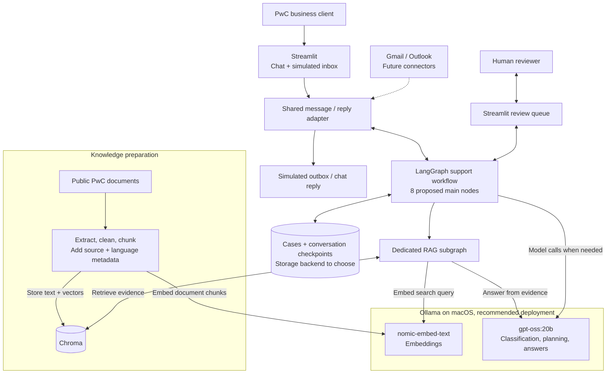
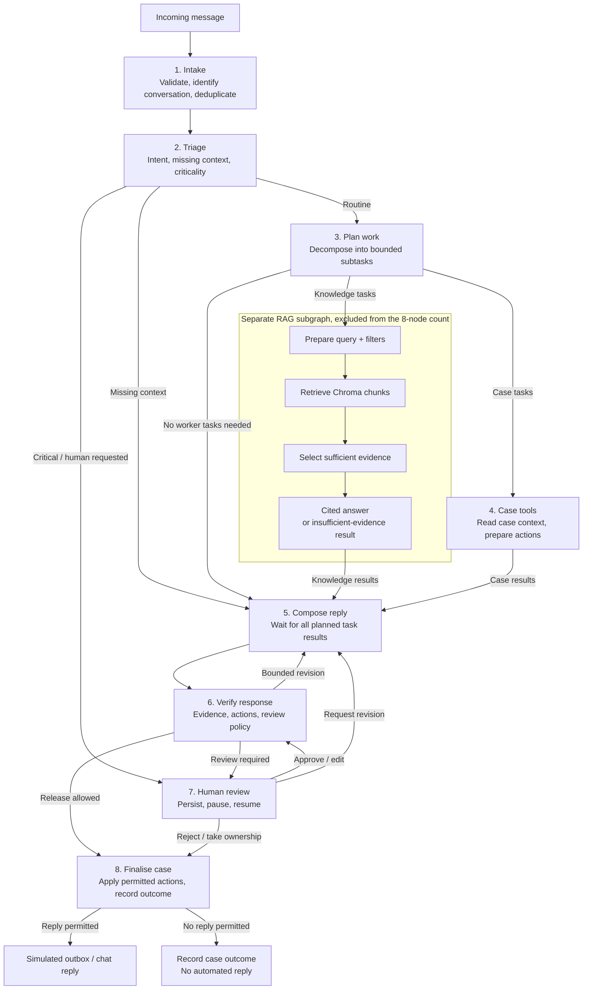

# PwC support workflow: node proposal

Date: 2026-09-02

Status: proposed for user review during Superpowers brainstorming. No application code has been written. This is a decision aid, not the approved specification or implementation plan.

## Architectural options

| Approach | Advantages | Trade-offs |
|---|---|---|
| One stateful graph with eight explicit main nodes, recommended | Clear boundaries for routing, independent work, response checks, human review, and side effects; easy to display and evaluate each stage | More graph wiring than combining responsibilities into fewer nodes |
| A compact graph with five main nodes plus RAG | Meets the minimum while reducing node definitions | Combines classification/planning or composition/validation, making timing and error attribution less granular |
| A supervisor coordinating autonomous specialist agents | Useful when specialists need genuinely different tools, context, or independent reasoning loops | More orchestration and more variable execution; additional agent loops must fit the local model budget |

The recommendation is based on the requested prototype and hardware. It does not claim measured performance superiority. A graph node is an application responsibility, not necessarily a separate autonomous agent or an LLM call.

## System components

The user requested a diagram to inspect how the proposed system works. This figure shows logical components and calls/data flow; it does not select the final service/container split or state-storage backend. Dashed links mark future integrations.

The shared channel adapter handles both incoming messages and outgoing replies. For version 1, outgoing delivery is simulated. Query/document embedding uses the selected Nomic model; generation uses GPT-OSS. Case records and graph checkpoints are separate logical data from the Chroma knowledge index.

## Proposed main nodes

Count: eight named main-workflow nodes. The RAG subgraph, its invocation wrapper, its internal nodes, and START/END sentinels are excluded from this count.

| # | Node | Responsibility | Implementation character |
|---|---|---|---|
| 1 | `intake` | Validate the normalized message, establish internal conversation/case identity, detect duplicate inputs, and load relevant state | Deterministic Python and persistence |
| 2 | `triage` | Identify intent, industry/service context, missing information, and review triggers; route to planning, clarification, or immediate review | Structured LLM output plus explicit policy checks |
| 3 | `plan_work` | Decompose a compound enquiry into a bounded list of knowledge and case-context subtasks, and declare proposed actions | Structured planning; simple requests can use a fixed task template |
| 4 | `case_tools` | Execute approved read-only demo-case lookups and validate/prepare requested case actions | Typed tool calls; side effects are deferred to finalisation |
| 5 | `compose_reply` | Assemble knowledge-subgraph answers and case results into a reply; generate a clarification when required | Reuse a sufficient single answer directly, or use the shared LLM to compose combined results |
| 6 | `verify_response` | Check referenced evidence, required context, proposed actions, and review requirements; route to finalisation, bounded revision, or a human | Deterministic checks; any semantic/model judge is an additional fallible signal |
| 7 | `human_review` | Persist a review request, pause, and accept approval, edits, rejection, revision requests, or human takeover | LangGraph interrupt/resume and validated reviewer input |
| 8 | `finalise_case` | Apply permitted case mutations and create a simulated outgoing reply when release is allowed; record takeover, rejection, and delivery outcomes | Idempotent tools and mailbox adapter; no free-form LLM action execution |

The exact names and boundaries can change after review. Approval of this structure would not silently select the remaining policy and infrastructure choices.

## Dedicated RAG subgraph

Proposed internal responsibilities, to be refined in the retrieval-design discussion:

1. Prepare a task-specific query and allowed metadata filters.
2. Retrieve relevant Chroma chunks using Nomic embeddings.
3. Select sufficient evidence within the token budget; optionally rerank if that is selected later.
4. Produce a cited knowledge answer with `gpt-oss:20b`, or return an explicit insufficient-evidence result.

Return the task identifier, answer or abstention, source/chunk references, evidence excerpts, and diagnostics. This makes the subgraph independently testable as a RAG unit. Keep case mutations and email delivery in the main workflow.

[LangGraph subgraphs](https://docs.langchain.com/oss/python/langgraph/use-subgraphs) support an explicit mapping between parent and child state. Use a discoverable graph-node boundary so subgraph progress can be inspected, rather than hiding the entire subgraph behind an opaque tool loop.

## Proposed routes

The diagram shows responsibilities, not a claim that any task result immediately triggers reply generation. For a decomposed request, composition waits until every expected task has a success, failure, or explicit skipped result. Use task IDs and a merge policy so parallel writes do not overwrite one another and retries do not duplicate evidence. Plans with no worker tasks take the direct composition path.

For immediate critical review, the review packet may contain the original enquiry and triage details without a drafted substantive answer. Approval or edits return through validation. Rejection/takeover finalises the administrative case outcome without releasing an unapproved response.

## Independent-subtask example

Example enquiry: "Explain PwC's risk services for insurers, and tell me the status of demo case DEMO-104."

- Knowledge task: invoke the RAG subgraph for the public service information, using insurance/service metadata where available.
- Case task: call a read-only tool against the demo case store using the authorised fixture identity.
- Each task produces its own result and failure status. Neither depends on the other's result.
- Composition combines the service answer and case status only after both tasks terminate.

A request to create a follow-up case produces a proposed action. The actual stored case creation occurs in finalisation after the relevant policy checks and any required review. That is the substantive non-retrieval operation. At least two actual tools can be demonstrated through demo-case lookup and case creation/update, in addition to retrieval within RAG.

[LangGraph's Graph API](https://docs.langchain.com/oss/python/langgraph/graph-api) provides conditional routing, `Send` for task dispatch, and reducers for merging state. Use these within an allowed task schema and a bounded task count. Graph-level independent work does not require concurrent LLM generations: the initial proposed generation limit remains one, while independent I/O and case operations can overlap where useful.

## State and execution obligations

Proposed state domains: message/conversation identity, triage result, plan version and expected task IDs, task results, evidence references, draft reply/version, proposed actions, review status/decision, retry counters, and finalisation/delivery status. The final schema remains to be specified.

- Separate customer-facing reply content from internal review notes and traces.
- Preserve the reason for human review and the exact draft/action version covered by an approval. Regeneration or a material new message invalidates prior approval for the old version.
- Use bounded retry/revision counts and explicit fallback states. A model's self-reported confidence is not sufficient evidence for automatic release.
- Serialize conflicting updates within one conversation. Concurrent independent conversations must remain isolated.
- Record per-node timing and model calls; report human waiting time separately from execution latency.
- A semantic verifier can flag problems but cannot guarantee factual correctness. Evaluation must measure grounding and routing independently.
- Finalisation cannot truthfully claim a case was created or a reply dispatched before the corresponding operation succeeds. If a case ID is needed in the reply, insert it after successful creation through a controlled finalisation step. A changed action or substantive response requires renewed validation.

[LangGraph interrupts](https://docs.langchain.com/oss/python/langgraph/interrupts) restart the interrupted node when resumed. Keep review pauses separate from non-idempotent mutations, and verify resume behavior using the chosen persistent checkpointer.

## Review question

What would you change in this main-node structure? The user has clarified that supported general questions should be answered automatically, with review for applicable cases. Detailed critical-case criteria, storage, retrieval settings, and UI/service deployment remain to be discussed.
