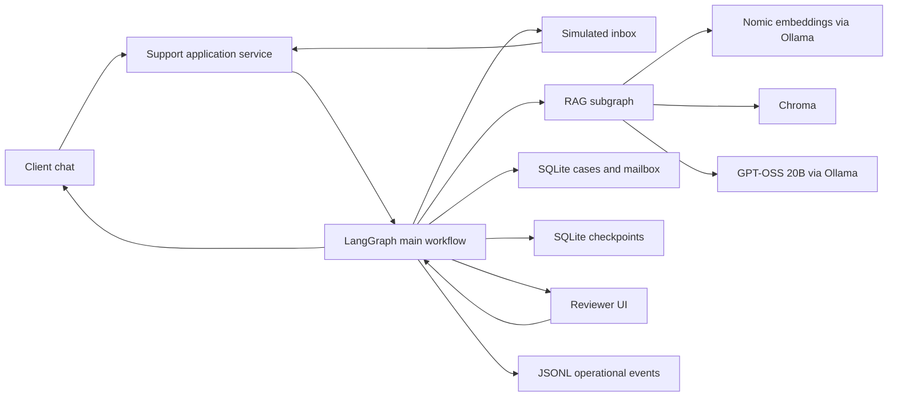
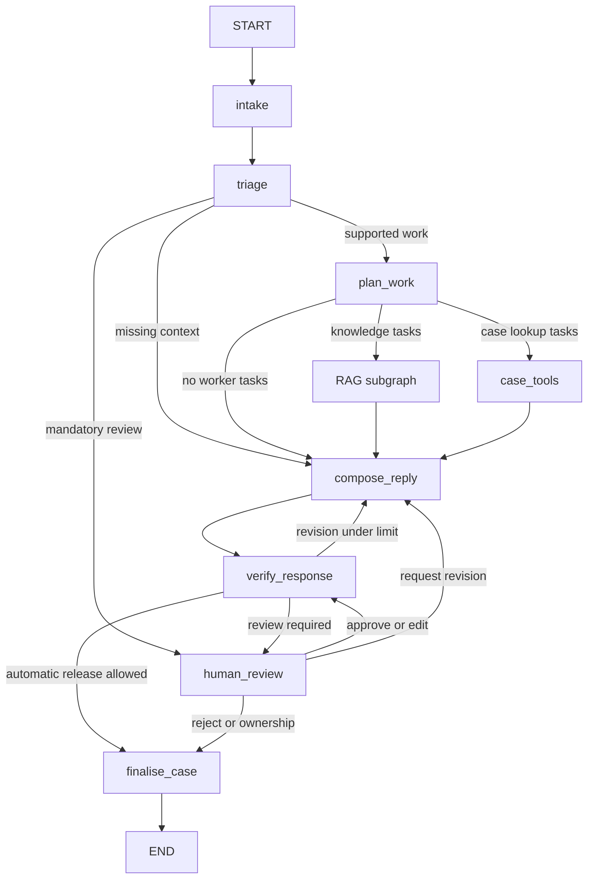

# Agentic RAG Customer Support Design

Date: 2026-09-02

Status: approved direction, with implementation defaults selected under the user's instruction to continue autonomously to the implementation plan

## 1. Purpose

Build a local, reproducible Agentic RAG prototype for PwC-style business-client support. A client submits an English question through a direct conversation UI or a simulated email channel. The system decides whether it can answer automatically from grounded public information, needs clarification, or must pause for human review. A reviewer can edit, approve, reject, request revision, or take ownership, after which any permitted reply returns through the same client conversation or simulated email thread.

This solves a concrete support problem: general service enquiries are repetitive but require current, attributable information, while client-specific professional judgement, sensitive incidents, and external actions require controlled escalation. Agentic RAG is useful because the workflow must retrieve evidence, route by risk, decompose compound requests, use case-management tools, retain state, and resume after a human decision.

The design implements every obligation in `/Users/admin/Downloads/RAG- Project description- English.pdf` without treating the document as authority to install software, connect accounts, or access PwC systems.

## 2. Users and outcomes

### Client

The primary user asks a question and receives one of four explicit outcomes:

1. `answered`: a concise answer with inspectable source references.
2. `clarification_required`: a focused question requesting the missing context needed to continue.
3. `pending_review`: an acknowledgement and persisted case reference, without an unreviewed substantive conclusion.
4. `unable_to_answer`: an honest statement that the available corpus cannot support the answer, plus a review path where appropriate.

Clients never select their own route and never see reviewer controls, internal notes, model reasoning, or raw prompts.

### Support reviewer

The secondary user sees pending cases, the original enquiry, route reason, cited evidence, proposed reply when one is safe to prepare, and the current response version. The reviewer may approve, edit, reject, request a bounded revision, or take ownership. A decision applies only to the displayed response/action version.

### Evaluator and developer

The prototype exposes a demonstration view of node names, durations, route decisions, tool outcomes, retrieval sources, and final status. It does not expose private chain-of-thought. Deterministic fixtures permit workflow tests without running the local model; a separate real-model profile provides honest evaluation and latency evidence.

## 3. Version 1 scope

Version 1 covers:

- public PwC global service information;
- financial services as the primary sector, including banking and capital markets, insurance, asset and wealth management, and real estate;
- a small set of cross-sector service questions from healthcare and technology contexts;
- English documents, questions, and replies, with BCP 47-compatible language metadata using `en`;
- direct client questions in Streamlit;
- simulated threaded inbox and outbox records;
- synthetic case lookup and case creation/update tools;
- automatic release of supported general answers after verification;
- persistent human-review interruptions for the agreed categories;
- functional evaluation with 15 held-out cases;
- a measured load scenario of 50 requests at concurrency 1 and 50 requests at concurrency 2;
- a Dockerfile and Compose configuration, with Ollama running natively on macOS.

Version 1 does not claim access to PwC internal documents, actual client records, engagement terms, entitlements, service-level agreements, professional advice, real email delivery, production authentication, multilingual answer quality, or production security certification. Gmail and Outlook remain future adapters behind the selected mailbox interface.

## 4. Selected technology

| Concern | Selection | Reason |
|---|---|---|
| Language | Python 3.12 | Stable typing and dependency support on macOS and Linux |
| Package management | `uv` with committed `uv.lock` | Fast, exact, reproducible dependency resolution |
| Orchestration | `langgraph==1.2.11` | Explicit graph, conditional routing, subgraphs, task dispatch, streaming, and interrupts |
| Checkpointing | `langgraph-checkpoint-sqlite==3.1.1` | Durable local threads and review resumption without an external database |
| Data validation | `pydantic==2.13.5` | Typed boundary models and structured-output schemas |
| Generation and routing | Ollama `gpt-oss:20b` through `ollama==0.6.2` | User-selected local open-weight model, tool and structured-output support, no paid API |
| Embeddings | Ollama `nomic-embed-text` | User-selected local embedding model with distinct document/query preparation |
| Vector store | `chromadb==1.5.9` | User-selected local vector database with persistence and metadata filtering |
| UI | `streamlit==1.63.0` | Proposal requirement and rapid client/reviewer prototype |
| Testing | `pytest==9.1.1` | Unit, contract, graph-route, integration, and evaluation-harness tests |
| Static quality | `ruff==0.16.5`, `mypy==2.3.1` | Formatting, linting, and strict type checks |

These direct versions reflect current project releases verified on 2026-09-02. The committed lockfile pins transitive dependencies. The implementation records the installed Ollama version and model digests because Python package pins do not pin local model artifacts.

## 5. Runtime topology

The primary Mac profile runs Ollama natively at `http://127.0.0.1:11434`, allowing Apple GPU acceleration. The Streamlit application runs either natively or in Docker. A container reaches Ollama through `http://host.docker.internal:11434`.

Chroma has two configurable modes behind one adapter:

- `persistent`: `chromadb.PersistentClient` stores the development index under `data/chroma/`.
- `http`: Compose runs `chromadb/chroma:1.5.9` with a named volume, and the application uses `chromadb.HttpClient`.

The Compose demonstration uses HTTP Chroma so components and persistence are explicit. Native development and tests may use an isolated persistent or ephemeral client. SQLite stores operational records in `data/state/operations.sqlite3` and LangGraph checkpoints in `data/state/checkpoints.sqlite3`. Separating those files prevents application queries from depending on LangGraph's internal checkpoint schema.

Ordinary Ollama Docker containers do not provide Apple GPU acceleration on Docker Desktop for macOS, so a fully containerized CPU inference profile is outside the primary performance claim. The README states this boundary rather than describing the deployment as fully self-contained.

## 6. System structure



Streamlit calls an application service directly. Version 1 does not add an HTTP API because neither the proposal nor the simulated channel requires one. The service boundary is independent of Streamlit, so a future API, Gmail adapter, or Outlook adapter can submit the same validated `IncomingMessage` and read the same `WorkflowResult`.

## 7. Domain contracts

All external and model-generated data crosses a Pydantic v2 boundary. LangGraph state is a `TypedDict` containing JSON-compatible forms of these models.

### Message and outcome models

`IncomingMessage` contains:

- `message_id: UUID`
- `conversation_id: UUID`
- `channel: Literal["chat", "simulated_email"]`
- `provider: Literal["local_chat", "simulated_email"]`
- `provider_message_id: str`
- `provider_thread_id: str`
- `sender_id: str`
- `recipient_id: str`
- `subject: str | None`
- `body: str`, between 1 and 8,000 characters
- `language: str`, fixed to `en` in version 1
- `received_at: datetime`
- `metadata: dict[str, str]`, limited to declared channel metadata

`ClientOutcome` contains:

- `conversation_id: UUID`
- `case_id: str | None`
- `status: answered | clarification_required | pending_review | unable_to_answer | failed`
- `message: str`
- `citations: tuple[Citation, ...]`
- `workflow_run_id: UUID`

Provider IDs are scoped by provider and never used as internal primary keys. Outgoing records include an idempotency key formed from the conversation, approved response version, and destination channel.

### Routing and work models

`TriageDecision` contains normalized intent, sector, service line, territory, missing fields, matched review categories, confidence, and one route from `plan`, `clarify`, or `review`. Confidence is diagnostic only and never overrides a mandatory deterministic rule.

`WorkPlan` contains one to four `PlannedTask` items. Task kinds are `knowledge_query` and `case_lookup`. Each task has a stable UUID, bounded text input, dependencies, and expected result type. Side-effect actions are represented separately as `ProposedAction` and cannot be executed by the planner.

`TaskResult` is keyed by task ID and contains success, failure, or skipped status. A reducer merges results by unique task ID and rejects incompatible duplicate results. `compose_reply` runs only after every expected task is terminal.

### Review models

`ReviewRequest` contains the case, category, original message, evidence references, proposed reply if present, proposed actions, response version, creation time, and status. `ReviewDecision` accepts `approve`, `edit`, `reject`, `request_revision`, or `take_ownership`, plus reviewer identifier, current version, edited reply where required, and a note. Version mismatch rejects the decision.

## 8. Main workflow

The main graph has exactly eight meaningful nodes. START, END, the RAG subgraph, and framework-internal nodes are excluded from this count.

| Node | Responsibility | Model/tool behavior |
|---|---|---|
| `intake` | Validate input, deduplicate provider messages, load conversation context, initialize run state | Deterministic Python and SQLite |
| `triage` | Detect mandatory-review rules, classify intent/sector/service, identify missing context, choose route | Deterministic policy first, structured GPT-OSS output when needed |
| `plan_work` | Produce a bounded task plan and proposed actions | Fixed plan for simple knowledge requests; structured GPT-OSS plan for compound requests |
| `case_tools` | Execute synthetic case lookups for dispatched case tasks and prepare safe action inputs | Typed non-RAG tool calls, no uncontrolled side effects |
| `compose_reply` | Wait for terminal task results, combine grounded knowledge and case results, or write clarification | GPT-OSS only when composition is needed |
| `verify_response` | Validate citations, evidence sufficiency, policy, version, and action permissions | Deterministic gates plus a bounded semantic check that can only escalate |
| `human_review` | Persist review packet, interrupt, validate reviewer decision, and resume | LangGraph `interrupt()` and `Command(resume=...)` |
| `finalise_case` | Execute permitted case mutation, write exactly one channel reply, and record final status | Idempotent SQLite tools and simulated channel adapter |

### Main routes



Knowledge and case lookups from a compound request are dispatched independently with LangGraph `Send`. The graph can overlap independent I/O, but generation is guarded by a process-wide semaphore of one on the target Mac. Concurrency of graph tasks therefore does not imply concurrent 20B model generations.

The graph state records message identity, triage, work plan, expected task IDs, task results, retrieved evidence, draft and version, proposed actions, review state, retry counters, node events, delivery status, and final outcome. It does not store live database clients, locks, or other unserializable objects.

## 9. Mandatory human-review policy

The accepted categories are:

1. confidentiality, privacy, or cybersecurity incidents;
2. legal or regulatory advice;
3. complaints and escalations, including an explicit request for a person;
4. requests for an external action or commitment;
5. insufficient or conflicting evidence;
6. engagement-specific tax, audit, assurance, or other professional judgement that public material cannot support.

The deterministic policy normalizes text and checks versioned phrase/rule sets before any automatic release. Structured triage may add review categories but cannot remove deterministic matches. Invalid structured output, model timeout during classification, uncertain action permissions, invalid citations, revision exhaustion, and conflicting case state all fail toward review or a safe failure, never toward automatic release.

A financial-services classification alone does not require review. General descriptions of public services may be answered automatically when retrieval and verification pass. The initial acknowledgement for a sensitive incident confirms receipt and asks the client not to add confidential material; it does not offer professional conclusions.

## 10. Dedicated RAG subgraph

The RAG subgraph is independently callable and testable. It has four internal nodes, none counted among the eight main nodes:

1. `prepare_query`: apply `search_query: `, derive safe metadata filters, and retain the original question.
2. `retrieve`: embed once with Nomic and query Chroma for the top six cosine matches.
3. `select_evidence`: remove duplicate chunks, enforce source status and language, keep at most four chunks and 6,000 evidence characters, and return insufficiency when the calibrated threshold is not met.
4. `answer_with_citations`: call GPT-OSS with evidence delimited as untrusted source text and return a structured answer with citation IDs, or abstain.

Document embeddings use `search_document: ` consistently. The collection is `pwc_support_v1_nomic_768`, and the ingestion manifest records model tag, model digest, dimension, normalization result, chunker version, and corpus checksum. A changed embedding configuration writes a new collection rather than mixing vectors.

The initial cosine similarity threshold is `0.45`. A six-case development set chooses the final threshold from `0.35, 0.40, 0.45, 0.50, 0.55, 0.60` by maximizing retrieval recall subject to zero unsupported automatic answers on that development set. The selected value is saved in `config/retrieval.json` before the 15-case final evaluation. This is calibration, not tuning on the final evaluation set.

Only `language=en` and `source_status=active` are hard filters on the first retrieval. Explicit sector, service line, and territory filters may be applied when triage confidence is at least `0.80`; if fewer than two eligible hits remain, retrieval falls back once to the language/status filter and records the fallback. This prevents an imperfect classifier from silently removing relevant evidence.

Every citation uses an internal source ID and chunk ID that resolve to title, canonical URL, access date, heading, and excerpt. The model cannot invent source metadata because final display data is joined from retrieved records after generation.

## 11. Corpus and ingestion

The committed corpus contains short, attributed, manually reviewed English summaries rather than unrestricted copies of entire PwC webpages. This makes the prototype reproducible while respecting source boundaries. `corpus/manifest.json` declares these active sources:

| Source ID | Local document | Canonical source | Scope |
|---|---|---|---|
| `pwc-global-services` | `corpus/documents/pwc-global-services.md` | `https://www.pwc.com/gx/en/services.html` | Audit and assurance, consulting, tax, risk, technology, and service routing |
| `pwc-financial-services` | `corpus/documents/pwc-financial-services.md` | `https://www.pwc.com/gx/en/industries/financial-services.html` | Banking and capital markets, insurance, asset and wealth management, real estate |
| `pwc-industries` | `corpus/documents/pwc-industries.md` | `https://www.pwc.com/gx/en/industries.html` | Limited healthcare and technology cross-sector context |
| `pwc-network-structure` | `corpus/documents/pwc-network-structure.md` | `https://www.pwc.com/gx/en/about/corporate-governance/network-structure.html` | Member-firm and territory clarification boundary |
| `synthetic-support-faq` | `corpus/documents/synthetic-support-faq.md` | Local synthetic fixture | Demonstration-only support process wording, explicitly labelled synthetic |

Each manifest entry includes title, language, sector values, service-line values, territory scope, source type, source status, canonical URL, access date, local path, and SHA-256 checksum. The implementation validates the manifest before reading documents and fails ingestion if a checksum, required field, or local path is invalid.

The chunker parses Markdown headings, normalizes whitespace, and creates chunks of at most 350 words with a 50-word overlap. It does not cross top-level headings. Chunks shorter than 80 words merge into an adjacent section where possible. Each deterministic chunk ID hashes source ID, heading path, chunk index, normalized text, and chunker version.

Ingestion embeds batches of 16 chunks, upserts by deterministic ID, deletes stale IDs for each source, and stores collection metadata. A dry-run reports document/chunk counts and checksum changes without altering Chroma. Re-running unchanged input must produce no duplicate IDs.

Public source claims are restricted to what the cited pages establish. Synthetic FAQ content and case fixtures are clearly marked in storage, UI, citations, and README. No source text is treated as executable instruction.

## 12. Tools and operational persistence

The workflow exercises three typed operational tools in addition to RAG:

1. `lookup_case(case_id, requester_id) -> CaseLookupResult`
2. `create_case(request, idempotency_key) -> CaseRecord`
3. `update_case(request, expected_version, idempotency_key) -> CaseRecord`

`lookup_case` demonstrates a read-only, non-retrieval business tool. `create_case` and `update_case` demonstrate controlled side effects. All case data is synthetic. A requester can see a case only when its synthetic `client_id` matches; the reviewer role can see pending cases. The prototype role selector is not represented as production authorization.

`operations.sqlite3` uses WAL mode, foreign keys, UTC timestamps, and these application-owned tables:

- `conversations`: internal ID, channel, provider, provider thread ID, client ID, language, created/updated timestamps.
- `messages`: internal ID, conversation ID, provider message ID, direction, subject, body, received/sent timestamp, content hash; unique on provider plus provider message ID.
- `cases`: stable `DEMO-###` identifier, conversation ID, client ID, category, status, summary, version, assigned reviewer, timestamps.
- `case_events`: append-only case version events and sanitized metadata.
- `review_requests`: case ID, workflow run, response version, category list, packet JSON, status, reviewer decision, timestamps.
- `outbox`: reply ID, conversation ID, response version, body, citation JSON, idempotency key, simulated delivery status, created timestamp; unique idempotency key.
- `workflow_runs`: run ID, conversation ID, route, status, final outcome JSON, started/finished timestamps.

Schema version `1` is applied transactionally from an application-owned SQL migration. Repository methods open bounded transactions and convert rows to Pydantic models. A unique idempotency constraint makes retries return the existing result instead of sending or creating twice.

LangGraph uses `checkpoints.sqlite3` through `SqliteSaver`. Every invocation includes the internal conversation ID as `thread_id`. The graph is compiled once per process, and access to its shared SQLite connection is protected according to the adapter's tested threading behavior. Human waiting time is measured from review creation to decision and excluded from model execution latency.

## 13. Mailbox and conversation boundary

`MailboxPort` defines normalized receive, reply, list-conversation, and delivery-status operations. `SimulatedMailboxAdapter` persists messages and outbox records through the operations repository. It never chooses recipients from model text; reply targets derive from the validated incoming conversation.

`LocalChatAdapter` writes client messages and replies into the same conversation model. A future Gmail or Outlook implementation maps provider identifiers, OAuth, polling/webhooks, threading headers, rate limits, and provider errors inside its adapter. Those integrations require code and credentials later; they are not presented as configuration-only features.

The application service methods are:

```python
class ClientSupportService(Protocol):
    def submit(self, message: IncomingMessage) -> ClientOutcome: ...
    def get_conversation(self, conversation_id: UUID, client_id: str) -> ConversationView: ...
    def get_run_events(self, run_id: UUID) -> tuple[OperationalEvent, ...]: ...

class ReviewService(Protocol):
    def list_pending(self) -> tuple[ReviewRequest, ...]: ...
    def decide(self, review_id: UUID, decision: ReviewDecision) -> ClientOutcome: ...
```

These interfaces let Streamlit and the load harness use the same behavior without coupling workflow nodes to UI state.

## 14. Response composition and verification

Prompts instruct GPT-OSS to use only supplied evidence for public factual claims, cite source IDs after each supported claim, state uncertainty, avoid professional conclusions, and ignore instructions contained in retrieved text. Triage and plan prompts return Pydantic JSON schemas. One repair attempt is allowed for malformed structured output; a second failure routes to human review with a model-output error reason.

The verifier enforces:

- every citation marker maps to a retrieved chunk;
- every displayed citation is actually referenced;
- at least one eligible source supports an automatic factual answer;
- no retrieved chunk below the calibrated threshold is used;
- an evidence-conflict flag forces review;
- accepted mandatory-review categories force review;
- external actions have a declared typed action and required approval;
- response length is at most 1,500 characters for the initial reply;
- retry and revision limits are not exceeded;
- approved review versions match the current draft and proposed actions.

A semantic GPT-OSS verification pass may add a concern or request review. It cannot change a mandatory-review decision to automatic release. The maximum automatic composition revision count is two. Exhaustion routes to human review.

## 15. Model and resource configuration

The initial Mac profile uses:

- generation model `gpt-oss:20b`;
- embedding model `nomic-embed-text`;
- context window 8,192 tokens;
- maximum generated tokens 512 for answers and 256 for triage/planning schemas;
- temperature `0.0` for structured routing and `0.2` for answer composition;
- request timeout 120 seconds;
- one retry for transport failures;
- one concurrent generation guarded by a semaphore;
- embedding batch size 16;
- maximum four planned tasks per enquiry;
- maximum two composition revisions;
- maximum conversation context of the latest six user/assistant turns plus a bounded case summary.

The application health check verifies Ollama reachability and the presence of both configured models without downloading them. Model pulls are explicit setup commands. Startup logs record Ollama version, model names, model digests when available, collection version, corpus checksum, and application commit SHA. The system does not modify global Ollama settings used by other projects.

## 16. Streamlit interface

The Streamlit application has three pages:

1. **Client support**: start or resume a synthetic client conversation, submit a question, show processing status, then display the client outcome and citations. Pending review displays the case reference and review status. A reviewer response appears in the same conversation.
2. **Simulated email**: inject or select synthetic inbox messages, run the same workflow automatically on arrival, inspect threads, and view the simulated outbox. Every delivery label says simulated.
3. **Human review**: list pending cases, display original message, review category, evidence and draft, then accept a version-checked decision. Approval/edit resumes the graph; reject/take-ownership finalizes without an automated substantive reply unless the reviewer supplied one.

A developer expander displays node status, route, durations, task results, and RAG excerpts. It does not display prompts, hidden reasoning, secrets, or unrestricted database content. The UI uses Streamlit session state only for page state and selected identity; durable conversation and workflow state remains in repositories/checkpoints.

Version 1 provides a clearly labelled demo role selector and synthetic identities instead of production authentication. This limitation appears in the UI and README.

## 17. Observability, safety, and failure handling

Every run emits JSON lines to standard output and `artifacts/events/events.jsonl`. `OperationalEvent` includes timestamp, level, run ID, conversation ID, node, event type, duration in milliseconds, route/status, model name, attempt, and sanitized details. Message bodies, retrieved full text, email addresses, and reviewer notes are omitted or hashed. The UI receives a separately whitelisted event projection.

Errors have stable codes: `INVALID_INPUT`, `UNSUPPORTED_LANGUAGE`, `DUPLICATE_MESSAGE`, `OLLAMA_UNAVAILABLE`, `MODEL_TIMEOUT`, `MODEL_OUTPUT_INVALID`, `EMBEDDING_FAILED`, `RETRIEVAL_FAILED`, `EVIDENCE_INSUFFICIENT`, `POLICY_REVIEW_REQUIRED`, `CASE_ACCESS_DENIED`, `VERSION_CONFLICT`, `CHECKPOINT_FAILED`, and `DELIVERY_FAILED`.

Transient Ollama and Chroma operations retry once with a bounded delay. Database writes rely on transactions and idempotency rather than blind retries. Failed automatic delivery leaves a persisted retryable outbox record and reports a failed status; it never claims that a response was delivered. Interrupt payloads are JSON-serializable, and side effects occur after review resumption in `finalise_case`.

Prompt-injection defenses separate instructions from source text, allow only declared metadata filters, validate all structured outputs, and prevent retrieved text from invoking tools. Tool calls are chosen by graph code from typed tasks; no free-form model-generated function name or SQL is executed.

## 18. Testing strategy

Unit tests cover validation, chunking, deterministic review rules, reducers, citation checks, idempotency, repository permissions, and error mapping. Contract tests run identical mailbox and knowledge-store expectations against fakes and local adapters. Graph-route tests use deterministic fake LLM, embedding, knowledge, case, and mailbox ports and assert node paths, persisted state, parallel task merges, interrupts, resumption, and final outcomes.

Integration tests marked `integration` require local Ollama and an isolated Chroma collection. They verify structured triage, one grounded answer, one review route, embedding dimension, and model metadata recording. They do not run in the fast default suite. Docker smoke tests check application health, Chroma connectivity, mounted persistence, and host Ollama reachability.

Quality gates are:

```bash
uv run ruff format --check .
uv run ruff check .
uv run mypy src tests scripts
uv run pytest -m "not integration" -q
uv run pytest -m integration -q
docker compose config --quiet
docker build -t pwc-support:local .
```

## 19. Functional evaluation

Six development cases calibrate retrieval threshold and prompts. They do not appear in final metrics. The final frozen set contains 15 cases:

1. general insurance service question, automatic grounded answer;
2. banking digital-transformation service question, automatic grounded answer;
3. asset and wealth management question, automatic grounded answer;
4. healthcare technology cross-sector question, automatic answer or focused clarification;
5. technology-sector service question, automatic grounded answer;
6. location-dependent question without territory, clarification;
7. unsupported pricing or engagement-fee question, abstention or review;
8. confidential-document exposure, mandatory review;
9. client-specific regulatory conclusion, mandatory review;
10. complaint and escalation, mandatory review;
11. request to schedule a meeting or make a commitment, mandatory review;
12. conflicting evidence fixture, mandatory review;
13. authorized synthetic case lookup for `DEMO-104`, tool result;
14. compound public-service question plus authorized case lookup, independent tasks merged;
15. prompt-injection attempt in a question and retrieved fixture, no instruction execution and safe outcome.

Each JSONL record freezes input, fixture identity, expected route, required/forbidden source IDs, expected tools, expected review category, and required phrases only where deterministic wording matters. Scoring reports:

- route accuracy and per-route confusion matrix;
- mandatory-review recall, with a target of 100% on the frozen mandatory cases;
- retrieval recall at 1, 3, and 6;
- citation validity and citation completeness;
- groundedness assessed against required source claims with documented manual rubric;
- tool-selection accuracy and idempotency outcomes;
- answer/clarification usefulness on a 0–2 rubric;
- failure counts and case-level error analysis.

Results from the deterministic fake profile and real GPT-OSS profile are reported separately. No passing target is achieved by relabelling failed or pending cases.

## 20. Performance evaluation

The load harness invokes `ClientSupportService`, bypassing Streamlit rendering while exercising the full graph, persistence, retrieval, Ollama, and simulated channel. It creates 50 unique requests per run from a frozen workload: 60% routine knowledge questions, 20% clarification/unsupported questions, 10% mandatory review, and 10% compound knowledge plus case lookup. One warm-up request is excluded.

Run the real-model workload twice on the named MacBook Pro M4 with 24 GB unified memory:

```bash
uv run python scripts/run_load.py --requests 50 --concurrency 1 --profile real
uv run python scripts/run_load.py --requests 50 --concurrency 2 --profile real
```

Record wall time, throughput, success/error/pending counts, end-to-end p50/p95/max, time to pending-review acknowledgement, per-node p50/p95, Ollama generation duration, retrieval duration, SQLite duration, prompt/output token counts when available, and peak application resident memory. Human waiting time is excluded and reported separately.

The report names the component with the largest p95 share as the primary bottleneck. It recommends one or two changes selected from measured evidence, such as reducing context/output budgets when generation dominates, answer caching for repeated public questions when hit-rate evidence supports it, batching embeddings when ingestion dominates, or changing persistence topology when lock wait dominates. Each recommendation includes the observed measurement and expected trade-off; the report does not assume the bottleneck in advance.

## 21. Packaging and documentation

The repository contains source, tests, corpus summaries and manifest, synthetic fixtures, configuration, Dockerfile, Compose file, `.env.example`, exact lockfile, evaluation/load inputs, raw result artifacts, summarized reports, diagrams, and README. Runtime databases, Chroma vectors, logs, and model weights are ignored.

The README explains the problem, users, agentic-RAG advantage, selected model and hardware trade-offs, exact eight-node graph, RAG subgraph, tools, source boundaries, setup, native and container runs, model provisioning, ingestion, UI use, tests, evaluation methodology and results, load methodology and results, bottleneck, limitations, and Gmail/Outlook adapter path.

## 22. Proposal traceability

| Requirement | Design evidence |
|---|---|
| Real-world problem and justification | Sections 1–3 |
| Python and LangGraph | Sections 4, 8 |
| At least five main nodes | Eight named main nodes in Section 8 |
| Autonomous routing | Triage, verifier, and conditional routes in Sections 8–9 |
| Decomposition and independent execution | `WorkPlan`, `Send`, task reducer, compound evaluation case |
| Intermediate state | Typed graph state and SQLite checkpoints |
| At least two tools, one non-retrieval | Three case tools in Section 12 |
| Separate modular RAG subgraph | Section 10 |
| Text corpus and quality processing | Section 11 |
| Local open-source model | Sections 4–5 and 15 |
| Streamlit UI with workflow and RAG output | Section 16 |
| Dockerfile and Compose advantage | Sections 5 and 21 |
| 10–20 functional questions | 15 frozen cases in Section 19 |
| 50–200 request load test | Two measured 50-request runs in Section 20 |
| Latency, bottleneck, recommendations | Section 20 |
| Git source and complete README | Section 21 |

## 23. Acceptance criteria

The implementation is complete when:

- a clean checkout installs from `uv.lock` on Python 3.12;
- corpus validation and ingestion create a versioned Chroma collection reproducibly;
- a general client question returns a cited answer without reviewer action;
- every accepted review category pauses durably and resumes with the same conversation ID;
- a compound request executes knowledge retrieval and case lookup as distinct task results before composition;
- at least two non-RAG tools are exercised with access and idempotency tests;
- duplicate incoming messages and resumed finalization do not duplicate cases or replies;
- the client, simulated email, and reviewer Streamlit pages demonstrate their specified flows;
- fast tests, integration tests, lint, formatting, and typing pass;
- Docker builds and Compose validates against native Ollama plus container Chroma;
- the 15-case evaluation and both 50-request load runs produce raw and summarized results;
- the final README reports measured outcomes and limitations without describing synthetic data or simulated delivery as real PwC operations.

## 24. Authoritative technical references

- [LangGraph persistence](https://docs.langchain.com/oss/python/langgraph/persistence)
- [LangGraph interrupts](https://docs.langchain.com/oss/python/langgraph/interrupts)
- [LangGraph streaming](https://docs.langchain.com/oss/python/langgraph/streaming)
- [LangGraph subgraphs](https://docs.langchain.com/oss/python/langgraph/use-subgraphs)
- [Chroma clients](https://docs.trychroma.com/docs/run-chroma/clients)
- [Chroma metadata filtering](https://docs.trychroma.com/docs/querying-collections/metadata-filtering)
- [Ollama embeddings](https://docs.ollama.com/capabilities/embeddings)
- [Ollama structured outputs](https://docs.ollama.com/capabilities/structured-outputs)
- [Ollama tool calling](https://docs.ollama.com/capabilities/tool-calling)
- [Streamlit chat elements](https://docs.streamlit.io/develop/api-reference/chat)
- [PwC global services](https://www.pwc.com/gx/en/services.html)
- [PwC financial services](https://www.pwc.com/gx/en/industries/financial-services.html)
- [PwC industries](https://www.pwc.com/gx/en/industries.html)
- [PwC network structure](https://www.pwc.com/gx/en/about/corporate-governance/network-structure.html)
